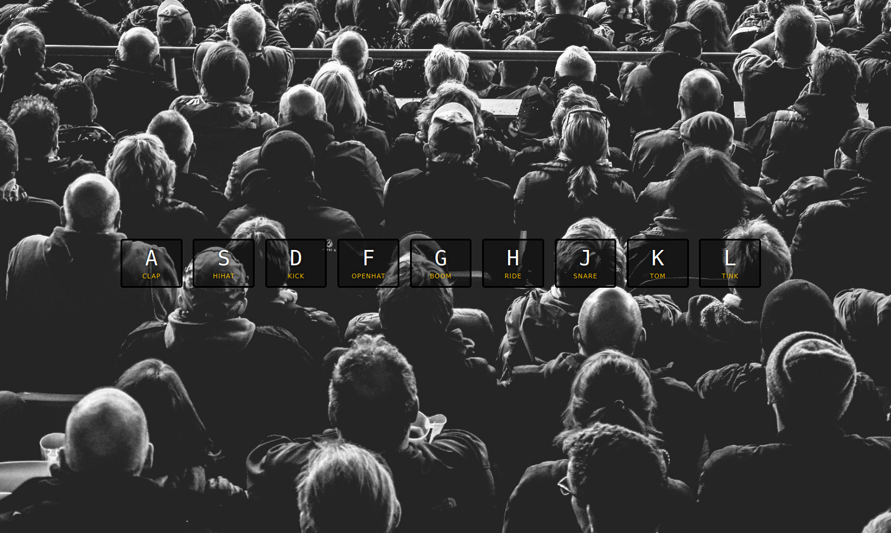
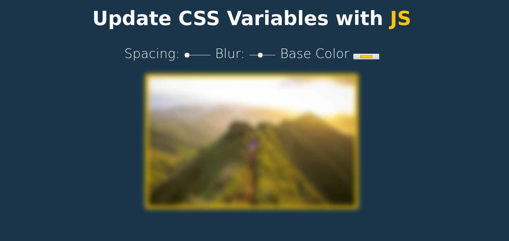
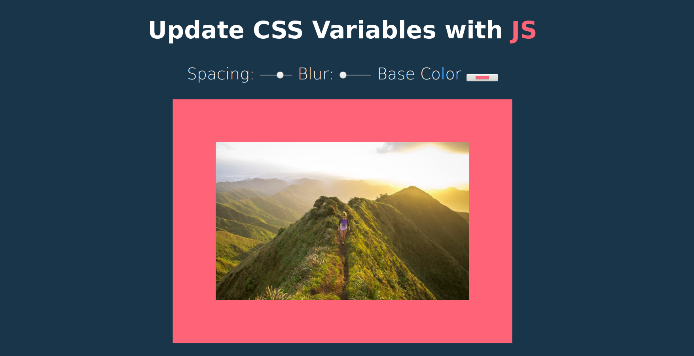

# JavaScript 30

O objetivo desse projeto é estudar JavaScript por 30 dias ininterruptos aplicando conceitos a projetos simples. Um projeto por dia.

## Dia 01 - JavaScript Drum Kit

> Ao clicar em um tecla predefinida um som será executado. Ao pressionar a tecla terá uma pequena animação com uma pequena borda amarela.

- DOM e interface
- Friends with CSS
- Audio + video

### Novos aprendizados com esse projeto

- tag `<kbd>` é usada para para inputs de teclados (keyboard input)
- Atributos de `data` armazenam dados personalizados particulares na página. Os atributos data- destinam-se a adicionar dados arbitrários a um elemento para uso exclusivo do código (geralmente JavaScript do lado do cliente) em execução no site que hospeda o HTML. **Qualquer atributo que comece com `data` será tratado como uma área de armazenamento de dados particulares (privada no sentido em que o usuário final não pode vê-lo - isso não afeta o layout ou apresentação).**
- atributo `data-key`

_Preview sem a animação do clique_


_Preview com a animação do clique_


## Dia 02 - JS + CSS Clock

> Relógio analógico que indica a hora atual e atualiza seus ponteiros normalmente.

- Friends with CSS
- Fundamentals

### Novos aprendizados com esse projeto

- `setInterval` é uma função temporizadora embutida que pode ser usada para chamar funções de retorno (callback functions) após um determinado tempo.

  - `setInterval` vai chamar a função passada indefinidamente sempre no intervalo de tempo passado.

- `new Date()` Cria uma instância JavaScript de Date que representa um único momento no tempo.
  - Note que objetos Date só podem ser instanciados chamando como um construtor (usando `new`): chamá-lo como uma função regular (ou seja, sem o operador new) irá retornar uma string ao invés de um objeto Date;
  - Existem metodos par manipular o objeto do tipo date;

_Preview relógio_


## Dia 03 - Update CSS variables with JS

> Atualizar dinâmicamento o CSS ao mexer com elementos da tela.

### Novos aprendizados com esse projeto

- input `type="color"` esse tipo de input abre um color pick
- Modificando uma variável no css

  ```javascript
  document.documentElement.style.setProperty(
    `--${this.name}`,
    this.value + suffix
  );
  ```

_Preview antes de modificar os inputs_


_Preview quando os inputs foram modificados_
