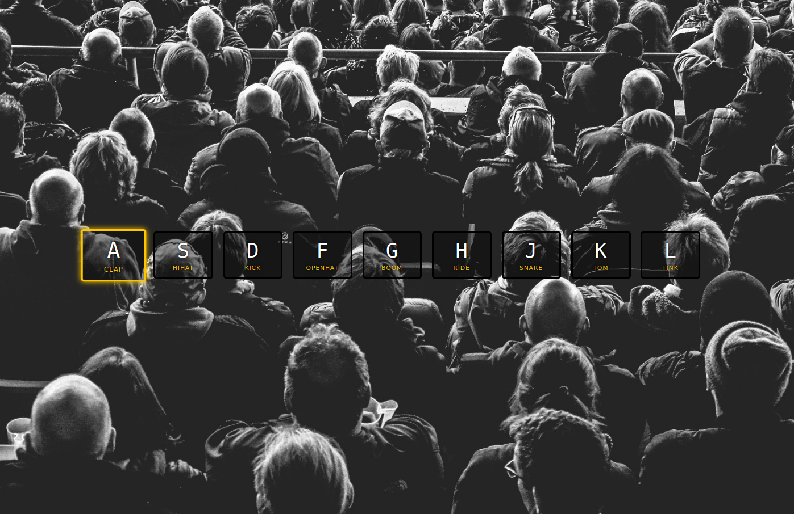

# JavaScript 30

O objetivo desse projeto é estudar JavaScript por 30 dias ininterruptos aplicando conceitos a projetos simples. Um projeto por dia.

## Dia 01 - JavaScript Drum Kit

> Ao clicar em um tecla predefinida um som será executado. Ao pressionar a tecla terá uma pequena animação com uma pequena borda amarela.

- DOM e interface
- Friends with CSS
- Audio + video

### Novos aprendizados com esse projeto

- tag `<kbd>` é usada para para inputs de teclados (keyboard input)
- Atributos de `data` armazenam dados personalizados particulares na página. Os atributos data- destinam-se a adicionar dados arbitrários a um elemento para uso exclusivo do código (geralmente JavaScript do lado do cliente) em execução no site que hospeda o HTML. **Qualquer atributo que comece com `data` será tratado como uma área de armazenamento de dados particulares (privada no sentido em que o usuário final não pode vê-lo - isso não afeta o layout ou apresentação).**
- atributo `data-key`

_Preview sem a animação do clique_


_Preview com a animação do clique_


## Dia 02 - JS + CSS Clock

> Relógio analógico que indica a hora atual e atualiza seus ponteiros normalmente.

- Friends with CSS
- Fundamentals concepts

### Novos aprendizados com esse projeto

- `setInterval` é uma função temporizadora embutida que pode ser usada para chamar funções de retorno (callback functions) após um determinado tempo.

  - `setInterval` vai chamar a função passada indefinidamente sempre no intervalo de tempo passado.

- `new Date()` Cria uma instância JavaScript de Date que representa um único momento no tempo.
  - Note que objetos Date só podem ser instanciados chamando como um construtor (usando `new`): chamá-lo como uma função regular (ou seja, sem o operador new) irá retornar uma string ao invés de um objeto Date;
  - Existem metodos par manipular o objeto do tipo date;

_Preview relógio_


## Dia 03 - Update CSS variables with JS

> Atualizar dinâmicamento o CSS ao mexer com elementos da tela.

- Friends with CSS
- Fun + experimentals

### Novos aprendizados com esse projeto

- input `type="color"` esse tipo de input abre um color pick
- Modificando uma variável no css

  ```javascript
  document.documentElement.style.setProperty(
    `--${this.name}`,
    this.value + suffix
  );
  ```

_Preview antes de modificar os inputs_


_Preview quando os inputs foram modificados_


## Dia 04 - Array Cardio Day 01

> entendendo arrays em javascript e seus métodos

- Fundamentals concepts

### Novos aprendizados com esse projeto

- `console.table` visualização dos dados em formato de tabela no console
- métodos
  - `filter()` - cria um novo Array contendo todos os elementos para os quais a função fornecida retorna verdadeiro 
  - `map()` - cria um novo Array contendo os resultados da aplicação da função a todos elementos do Array 
  - `sort()` - classifica o Array sem copiá-lo, opcionalmente usando um argumento comparador 
  - `reduce()` - aplica uma função simultaneamente para dois valores do Array (da
esquerda para a direita) de forma a reduzi-los a um valor único 

## Dia 05 - Flex Panel Galery With JS

> Painel usando display flex com animações ao clicar em cada painel

- DOM & Interface
- Friends with CSS

### Novos aprendizados com esse projeto

- `flex: 1;` ao fazer o espaço sobrando no container é redistruibuido igualmente entre os filhos.
- Um elemento filho pode ser também um container flex;

_Preview antes de clicar em um painel_


_Preview depois de clicar em um painel_


## Dia 06 - Ajax Type Ahead

> Busca assincrona num array que contém as cidades ou estados, você buscando por cidades ou estados qualquer letra ele já retorna algo.

- DOM & Interface


### Novos aprendizados com esse projeto

- *Ajax, o que é?*
  - AJAX significa Asynchronous JavaScript and XML, ou JavaScript e XML Assíncronos. **Ele é um conjunto de técnicas de desenvolvimento voltado para a web que permite que aplicações trabalhem de modo assíncrono, processando qualquer requisição ao servidor em segundo plano**.
  - Enquanto o HTML é utilizado para exibir dados, o XML os armazena e transmite.

- *Como o Ajax funciona?*
  - **HTML/XHTML** para linguagem principal e **CSS** para a apresentação.
  - **O Document Object Model (DOM)** para exibição dinâmica dos dados e interação.
  - **XML** para a troca de dados e XSLT para a manipulação. Muitos desenvolvedores começaram a substituir pelo JSON por ser mais semelhante ao JavaScript.
  - O objeto **XMLHttpRequest** para a comunicação assíncrona.
  - Finalmente, a linguagem de programação **JavaScript** para juntar todas essas tecnologias.

- *Modelo Ajax*
  1. O navegador gera uma chamada do JavaScript que então ativa o XMLHttpRequest.
  2. Em segundo plano o navegador cria uma requisição HTTP para o servidor.
  3. O servidor recebe a requisição, busca os dados e envia para o navegador.
  4. O navegador recebe os dados requisitados que irão aparecer imediatamente na página. Não é necessário recarregar.


_Preview antes do inicio da busca_


_Preview depois de colocar alguma letra_


## Dia 07 - Array Cardio Day 02

> Não tem interface gráfica, apenas aplicando alguns métodos do array.prototype

- Fundamentals


### Novos aprendizados com esse projeto

- `Array.prototype`: As instâncias de Array herdam de Array.prototype. Como em todos os construtores, você pode mudar o  protótipo desse construtor para modificar todas as instâncias de Array.

Contudo, a adição de métodos não-padronizados ao objeto array pode causar problemas futuros, seja com seu próprio código, ou na adição de novas funcionalidades ao JavaScript.

O próprio Array.prototype é um Array;

**Métodos de interação:**

Vários métodos tomam como funções de argumento para serem chamados de volta ao processar o array. Quando esses métodos são chamados, o `length` do array é amostrado e qualquer elemento adicionado além deste comprimento (length)  de dentro da função (callback) não é visitado. Outras alterações para o array (Definindo o valor de ou apagando um elemento) pode afetar os resultados da operação se o método visita o elemento alterado posteriormente. Enquanto o comportamento específico destes métodos nestes casos é bem definido, não se deve confiar nisso para não confundir os outros que possoam ler seu código. Em vez disso, deve-se copiar para um novo array para modificá-lo.

  - `.some()`: Retorna true se pelo menos um elemento no array satisfizer a função de teste fornecida.
  - `.every()`: Retorna true se todos elementos no array satisfizer a função de teste fornecida.
  - `.find()`: Retorna o valor encontrado no array, se um elemento no array satisfizer a funçào de teste fornecida ou  `undefined` se não for encontrado.
  - `.findIndex()`: Retorna o índice no array, se um elemento no array satisfizer a função de teste fornecida ou -1 se não for encontrado.


## Dia 08 - Fun With HTML5 Canvas

> COnstrução de um canvas com o HTML5, interagindo com mouse ou dedos para desenhar

- Fun + experimentals


### Novos aprendizados com esse projeto

- tag `<canvas>` A canvas nada mais é do que um espaço onde podemos desenhar elementos específicos, formas geométricas e imagens, por exemplo, através de script (javascript geralmente).
- Por Javascript podemos acessar métodos da canvas que desenham formas, linhas, caracteres e adicionar imagens.
- Primeiro de tudo vamos precisar para colocar a tag canvas em algum lugar dentro do nosso HTML, criar uma função JavaScript que acessa a tag canvas, uma vez que a página carrega e depois utilizar o HTML5 Canvas API para desenhar suas visualizações.
- `.getContext() `retorna um contexto de desenho no canvas, ou null se o contexto identificado não é suportado.
  - "2d", levando a criação de um objeto CanvasRenderingContext2D representando uma  renderização bidimensional.

- `.innerHeight` Altura (em pixels) da janela de visualização do navegador, incluindo, se renderizado, a barra de rolagem horizontal.
- `.innerWidth` retorna a largura interna da janela em pixels. Isso inclui a largura da barra de rolagem vertical, se houver uma. SOMENTE LEITURA
- `.strokeStyle` Define o estilo para os contornos (strokes) das formas.
- `.lineJoint`  determina a forma usada para unir dois segmentos de linha onde eles se encontram.
- `.lineCap` determina a forma usada para desenhar os pontos finais das linhas.
- `.beginPath()` inicia um novo caminho esvaziando a lista de subcaminhos. Chame esse método quando desejar criar um novo caminho.
- `.moveTo()` inicia um novo subcaminho no ponto especificado pelas coordenadas (x, y) fornecidas.
- `.lineTo()` adiciona uma linha reta ao subcaminho atual conectando o último ponto do subcaminho às coordenadas especificadas (x, y). Para desenhar o caminho em uma tela, você pode usar os métodos fill () ou stroke ().
- `.stronks()`  (contornos) do caminho atual ou fornecido com o estilo de traçado atual. Os traços são alinhados ao centro de um caminho; em outras palavras, metade do traçado é desenhado no lado interno e metade no lado externo.

_Preview dos desenhos no canvas_
